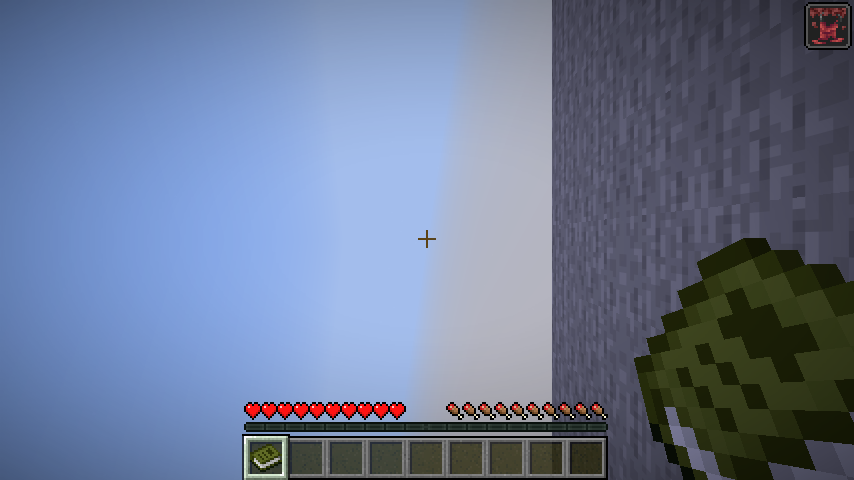

# Clinging: Reoriented

The floor is wherever you decide it is.

**Clinging: Reoriented** turns the Clinging effect from Alex's Mobs into an airborne gravity ability for Minecraft 26.2 on Fabric. Leave your local floor, release **Space**, look toward another world-cardinal direction and press Space again. Clinging grants one voluntary airborne gravity decision; **Reorientation** removes that one-turn limit.

[](https://www.minecraft.net/)
[](https://fabricmc.net/)
[](https://github.com/R3Neer/clinging-reoriented/actions/workflows/ci.yml)
[](LICENSE)



## The alpha.13 movement language

A voluntary turn changes **physical gravity immediately** but preserves the existing world-space velocity vector. Gravity changes acceleration, not momentum. Reversing gravity therefore brakes the old motion naturally, crosses zero speed, and only then accelerates the other way.

The local player's camera no longer rotates merely because gravity changed. While airborne, Clinging retains the world frame that was actually being rendered. Reorientation can therefore chain discrete acceleration choices while the camera remains the player's. `selectionLook` still uses the rendered look, so the retained camera remains a valid way to choose the next cardinal gravity direction.

When the real trajectory is about to meet a valid gravity-relative floor, Clinging commits that landing and rotates the retained frame toward the new floor. Quarter-turn landings use **180 ms** and opposite half-turn landings **240 ms**, with quadratic ease-out. A very late landing starts immediately rather than speeding the camera up unnaturally. During this short `LANDING_COMMITTED` window new gravity requests are discarded, never queued. If the surface genuinely disappears or another lifecycle owner takes over, the current displayed frame is preserved instead of snapping back.

## Gravity Fall body presentation

After **12 airborne ticks** under Clinging/Reorientation physics, a sustained fall enters Gravity Fall presentation. Over a **6-tick blend**, the player's macroscopic body root begins to follow the **actual world velocity**, not the current gravity or camera direction. Near zero speed it keeps the last reliable body frame, preventing flips when gravity reverses and velocity changes sign.

Approaching a future floor moves the body into BODY_LANDING and converges it toward the landing frame. This body presentation does not steer the camera and does not add air control. Fresh Animations, when installed, keeps ownership of limb animation, head tracking, equipment and micro-animation; Clinging adds only the macro body transform.

Elytra, water/lava, vehicles, death/respawn, teleport and foreign gravity ownership are explicit presentation boundaries. Elytra remains the continuous-flight mechanic; Clinging/Reorientation remain discrete gravity decisions.

## Impact damage follows the collision

Alpha.13 replaces gravity-turn fall-distance segmentation as the primary Clinging impact model. While the Clinging impact lifecycle is armed, damage comes from the **world-space velocity actually absorbed by a blocking collision**. That absorbed speed is converted to a vanilla-equivalent fall distance and delegated back into the vanilla block/fall pipeline whenever possible.

Consequences are deliberately physical: a late gravity turn cannot erase a high-speed collision with the old floor; genuinely braking by reversing gravity can reduce or remove the damage; tangential motion contributes little or nothing; and one multi-axis collision is handled once rather than once per blocked axis.

## Landing surfaces are extensible

Alpha.13 exposes a small public `LandingSurfaceProvider` / `LandingSurfaces` contract. Vanilla collision geometry is the base provider. External providers can report bounded support/predicted contact and stable identity for revalidation, but they cannot bypass Clinging's authority or physical preflight. Providers fail closed on stale, non-finite or invalid data.

The API intentionally contains no Scale Brews types. Concrete Scale Brews landing-surface integration is outside alpha.13 and belongs in a consumer/adapter layer rather than in Clinging's public contract.

## Existing controls retained

- **Clinging:** one successful voluntary airborne turn until real gravity-relative feet support restores the charge.
- **Reorientation:** unlimited voluntary airborne turns. Brew it by adding a shulker shell to a Clinging potion; ordinary extension/splash/lingering routes remain.
- **Water:** normal or held Space remains vanilla ascent. A deliberate second Space rising edge after a release within **250 ms** requests a gravity turn without consuming swimming input.
- **Sprint-jump protection:** an imminent supported landing reserves Space for vanilla sprint-jump. Normal `0.42` jump power keeps one tick; stronger effective jump power extends only that bounded prediction, capped at three ticks.
- **Elytra:** usable Elytra always has priority over gravity selection.

## Mounts and pets

Mounted Reorientation still turns a compatible airborne living root and its passenger hierarchy atomically. Pet replay still follows bounded owner breadcrumbs when the pet has its own compatible effect. These non-player entities keep Clinging's owned **180/240 ms tracked snap** presentation; alpha.13's free-flight camera hold is a local-player camera rule, not a generic mob camera concept.

Tracked entity transitions are fenced by entity UUID plus monotonic sequence and continue advancing while off-screen. Foreign Gravity Changer writes remain foreign and keep upstream presentation ownership.

## Install

Install the regular JAR on **both client and server** with:

- Minecraft 26.2
- Java 25
- Fabric Loader 0.19.5 or newer
- Fabric API 0.159.0+26.2 or newer
- Alex's Mobs Continued 2.1.9
- CodxLib 1.5.1 or newer
- Gravity Changer Unofficial Port 1.5.2-beta.5-mc26.2
- Cloth Config API

This is an **alpha**. Back up important worlds before updating and use matching versions on every multiplayer participant.

## Optional companions and compatibility

- **Alchemical Leather** remains optional and can supply Clinging/Reorientation through compatible equipment.
- **First Person 2.7.2** is tested with Not Enough Animations 1.12.4. Gravity Fall may rotate the body root, but that transform must not feed back into the camera.
- **Fresh Animations 1.10.5 + FA Player Extension 1.1 + EMF 3.3.5 + ETF 7.2** are exercised in a pinned client lane. They remain optional.
- **Scale Brews beta.5** is exercised in isolated server/client compatibility lanes. Production compile/runtime does not require it, and no concrete Scale landing adapter is part of this release.

## Project status

**0.1.0-alpha.13** is the gamefeel, landing and impact prerelease. Its release-candidate matrix covers build/JUnit, **86 server GameTests**, default client GameTests, First Person, optional Scale Brews server/client lanes, and a pinned Fresh Animations/Player Extension lane. CI also validates and preserves semantic screenshot checkpoints for retained camera, zero-speed stability, velocity-vs-gravity body orientation, cancelled landing, Falling/Elytra language, First Person and Fresh Animations landing progression.

Automated coverage is deliberately not called human gameplay QA. Dedicated multiplayer latency, motion-comfort/readability and long full-pack sessions remain manual acceptance work.

## Build and documentation

Use Java 25 and the included Gradle wrapper:

```powershell
.\gradlew.bat build runGameTest
.\gradlew.bat runClientGameTest
```

Production `compileClasspath` remains Scale-free. Optional compatibility fixtures are isolated test-only inputs.

- [Player guide](docs/GUIDE.md)
- [Architecture](docs/ARCHITECTURE.md)
- [Compatibility](docs/COMPATIBILITY.md)
- [Configuration](docs/CONFIGURATION.md)
- [Validation](docs/VALIDATION.md)
- [Changelog](CHANGELOG.md)

[GPL-3.0-or-later](LICENSE). Third-party projects keep their own licenses and are not bundled; see [credits and notices](THIRD_PARTY_NOTICES.md).

Not an official Minecraft product. Not approved by or associated with Mojang or Microsoft.
